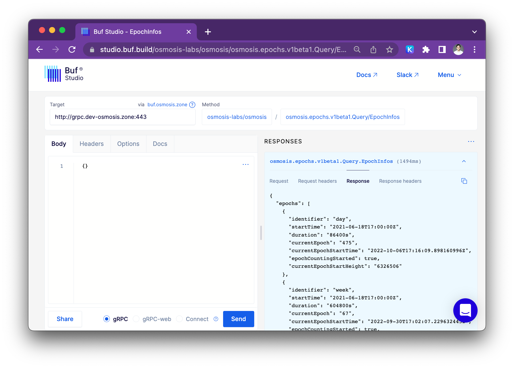

## Interacting with Buf Studio
An interactive web UI for all the gRPC and Protobuf services stored on the [Osmosis Buf Schema Registry](https://buf.build/osmosis-labs/osmosis)

Studio preconfigured with the mainnet RPC:
- [Launch Buf Studio on mainnet RPC](https://studio.buf.build/osmosis-labs/osmosis/osmosis.epochs.v1beta1.Query/EpochInfos?target=http%3A%2F%2Fgrpc.osmosis.zone%3A9090&selectedProtocol=grpc&agentUrl=https%3A%2F%2Fbuf.osmosis.zone&share=AQQA%2B%2F86Ant9)
- [Launch Buf Studio on testnet RPC](https://studio.buf.build/osmosis-labs/osmosis/osmosis.epochs.v1beta1.Query/EpochInfos?target=http%3A%2F%2Fgrpc.dev-osmosis.zone%3A443&selectedProtocol=grpc&agentUrl=https%3A%2F%2Fbuf.osmosis.zone&share=AQQA%2B%2F86Ant9)

Things you can do with buf Studio: 
- Select an endpoint from any BSR module to send requests to  gRPC
- Use the editor with schema-based autocompletion, validation and documentation to draft JSON based request messages.
- Configure headers to further customize outgoing requests.
- Optionally include cookies in outgoing request to send authenticated requests to private APIs (or Buf Studio Agent instances).
- Create shareable links for requests defined on Buf Studio to team members with access.

#### How does buf Studio work with Osmosis 

We have a Buf agent running at https://buf.osmosis.zone which will allow you to use the buf data studio to explore the available methods. 

#### Composing requests

