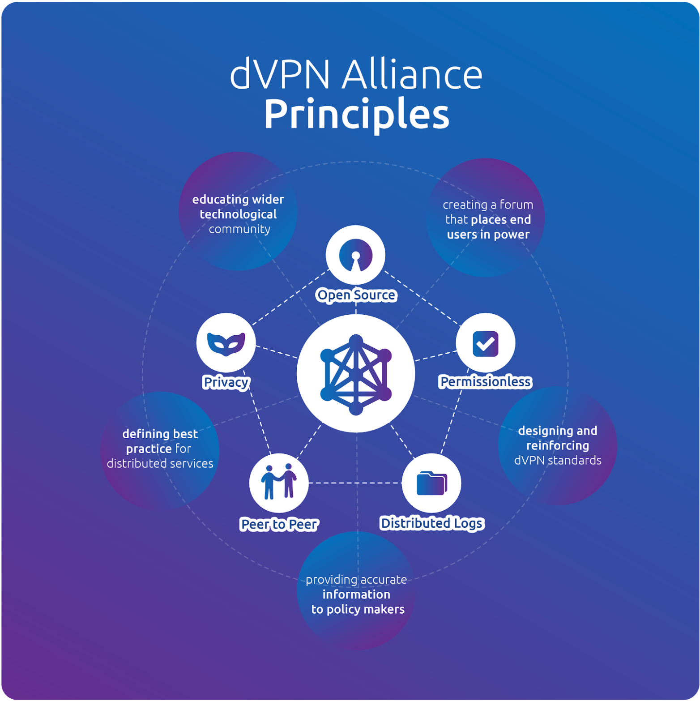

Since the start of the crypto revolution decentralization has always been a goal to strive for. We want to stop being depended on centralized entities big or small and taking a cut every step in between. By decentralizing the power everyone has a say and we do not have to trust any middleman facilitating any exchange, because there is no need for any middleman anymore. And herein lies the biggest difference between a VPN (centralized) and a dVPN (decentralized VPN). Why do you use a VPN in the first place:

- You want to be anonymous on the internet?
- You want to change your GEO location?
- You want to increase your security while surfing the web?

Well for all these reasons and there probably are a lot more you actually want to use a dVPN over a VPN. The reason for this is because normal VPNs are control by a centralized organization. They own the servers and other hardware you connect to. They know exactly who you are, where you are from and how you are using the internet since everything you do goes through their network. Can you be 100% sure they don’t keep any logs? Can you be sure they are really secure? What if they get hacked? Sensitive data from thousands or millions of people are at risk. Can you be sure those centralized organizations are not selling your data?

A dVPN is not owned by 1 centralized organization and Sentinel’s code is 100% open source. By open sourcing the code it reduces the chances of being hacked by a lot because so many smart and intelligent people can see how it works, point out vulnerabilities and help improve it. At the same time everyone can see that no logs are being kept by the Sentinel software. And even if 1 node gets hacked on its own (not through the Sentinel software itself), the damage is contained within that 1 node not effecting everyone else. That 1 dVPN node owner could see the metadata going through his network, but by using multiple relay nodes each owned by different owners, nobody has the complete metadata of your request.

As you can see with a dVPN there is no need to trust a centralized organization to be good as all that power is decentralized over the blockchain or different node owners. By using a dVPN you are free from the world, including the organization that used to provide you that freedom as a service.

## dVPN Alliance

With a goal to set standards within the VPN industry and wider privacy sector that moves us towards a free internet for all Sentinel is one of the founders of the dVPN Alliance. All bodies, foundations, companies interested in human rights on the internet are welcome.

For more information on the dVPN Alliance visit this dedicated website: [https://dvpnalliance.org](https://dvpnalliance.org)

If you want to get right into the core of this alliance visit the manifesto they have created: [https://dvpnalliance.org/manifesto](https://dvpnalliance.org/manifesto)

