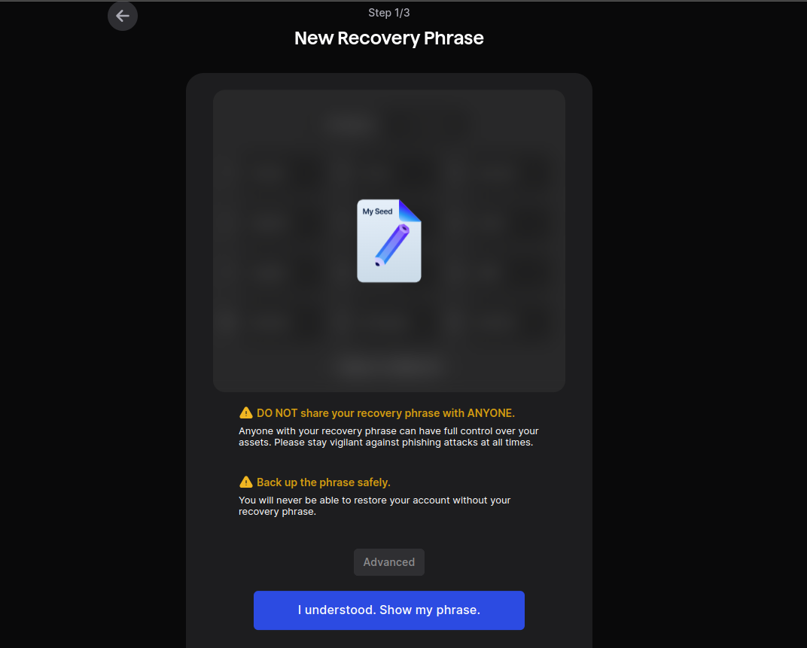
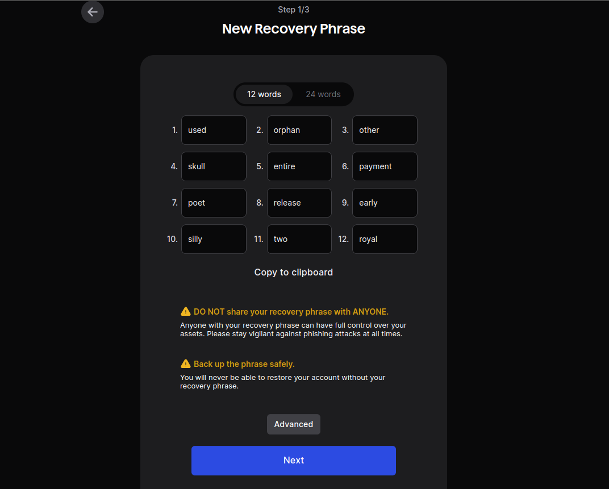
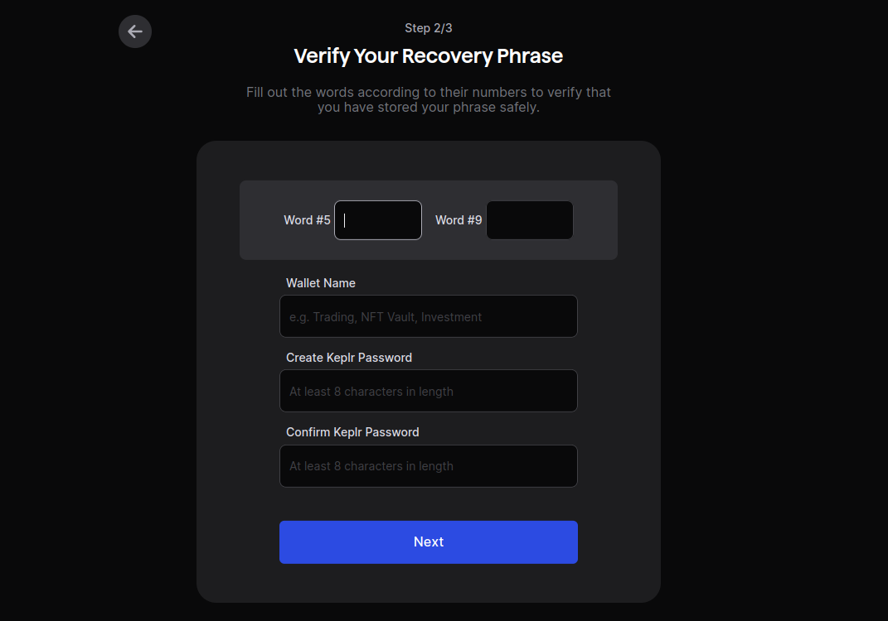
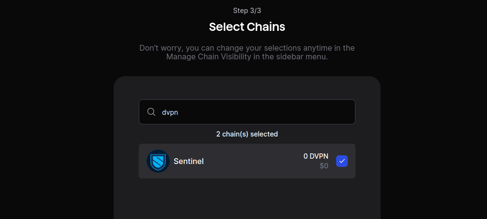

# Create Keplr Wallet

## How to create a new Account via Manemonic/Seed Phrase

If you are setting up Keplr for the first time: In the initial pop-up window, choose `Create New Recovery Phrase`

You will be prompet to a seed/mnemonic phrase of 24 words

You can change the derivation path by clicking on `Advanced`, but this is optional and not suggested for how we are going to use Keplr.
If you are interested in knowing more about the HD wallet derivation path, you can find more [here](https://help.keplr.app/articles/how-to-set-a-custom-derivation-path).

Click on `I understood. Show my phrase` and you will see your mnemonic phrase. Write the words on paper and store them in a secure place. Avoid taking screenshots of the words or copying them into your computer/phone notes.

You will now be prompet to:
- verify your mnemonic phrase
- add a wallet name
- add a wallet password

The account will be created and you will be prompted to add the Cosmos tokens you want to use with the created wallet; make sure to select DVPN.

You are now all set!