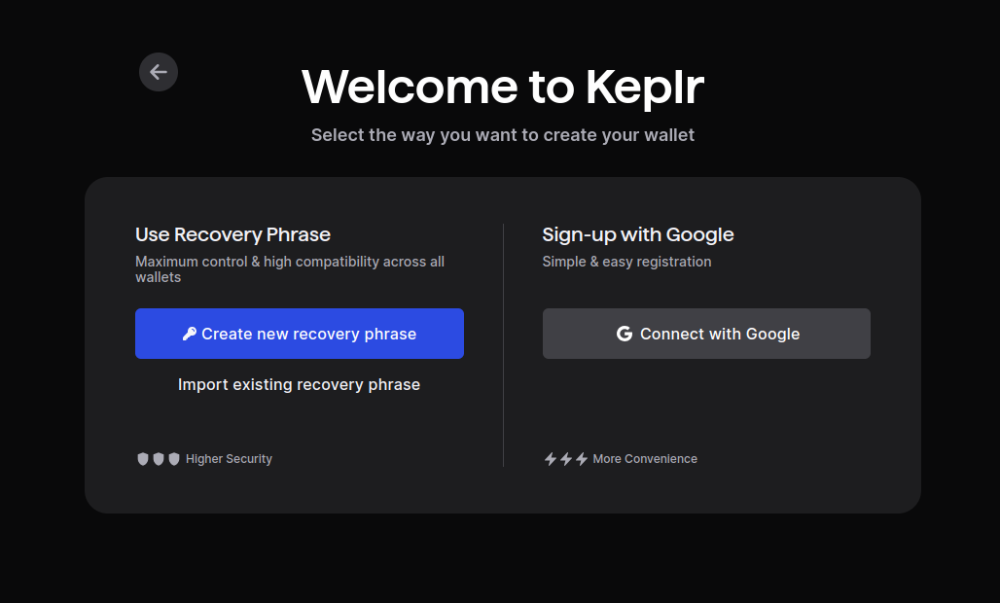
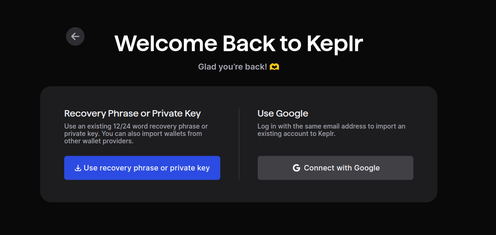
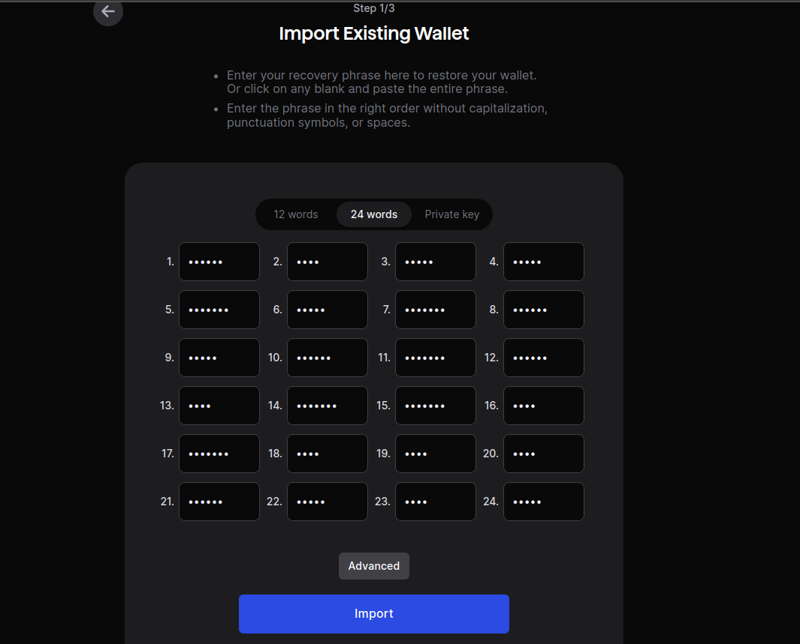
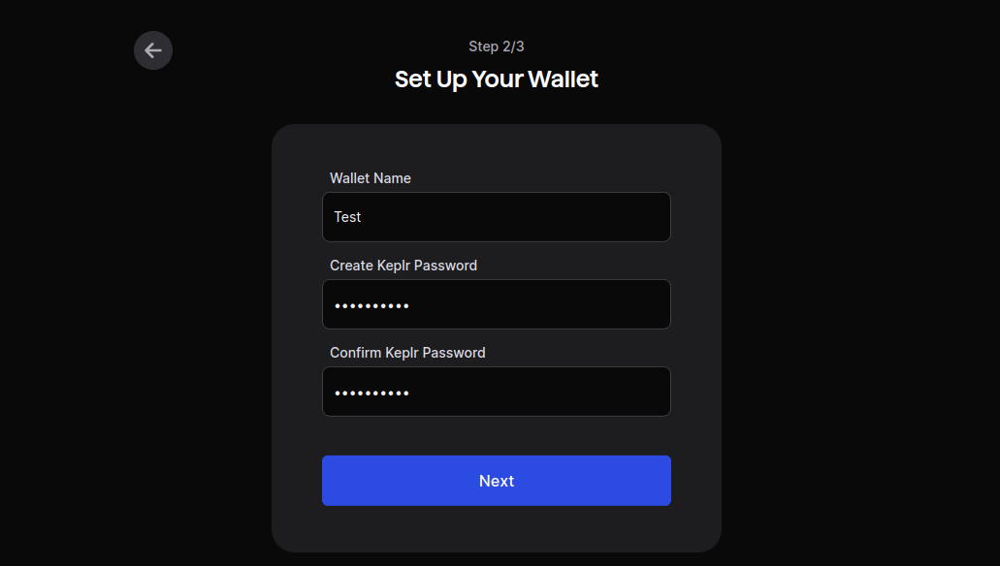

# Import a Keplr account

If you are setting up Keplr for the first time: In the initial pop-up window, choose `Import Existing Recovery Phrase`

At the following screen select `Recovery Phrase or Private Key`

Import your existing mnemonic

You will now be prompet to:
- add a wallet name
- add a wallet password

The account will be imported and you will be prompted to add the Cosmos tokens you want to use with the created wallet; make sure to select DVPN.

You are now all set!